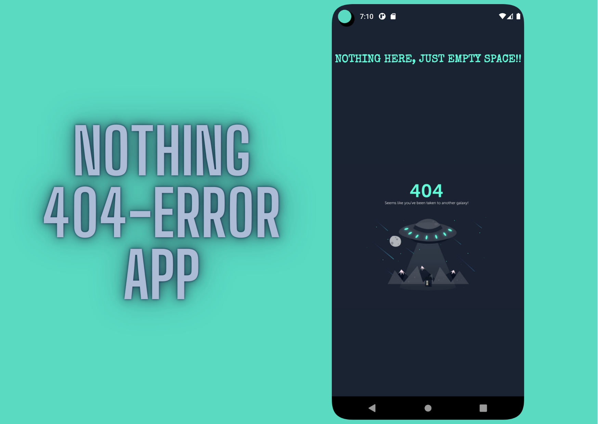

<h1 align="center"> Nothing-404-Error-App </h1>

 
 A simple, single activity app which shows stylish 404 error page. 

 
  
 

 

## Download

Go to the [Releases](https://github.com/deveshp007/Nothing-404-Error-App/releases/tag/V1.0.1) to download the zip.

Or directly [Download](https://github.com/deveshp007/Nothing-404-Error-App/releases/download/V1.0.1/app-debug.apk) APK.

## Tech stack

- Minimum SDK level 21
- Kotlin
- Material Design
- Glide Library
